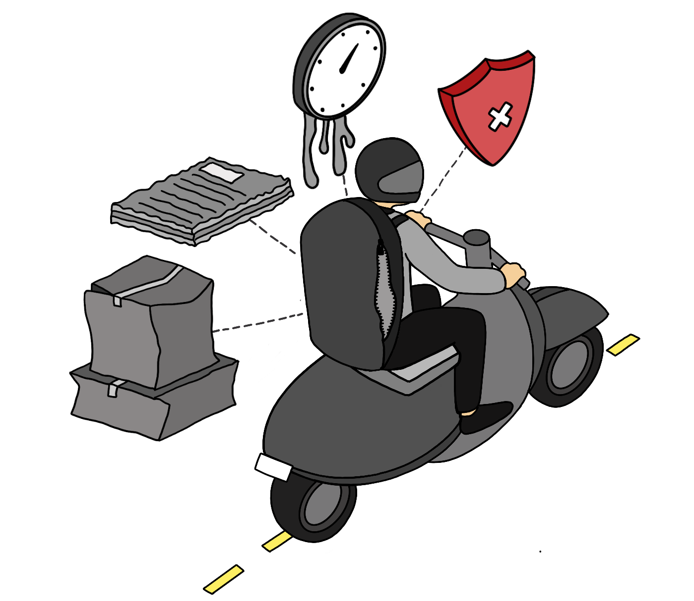

# DeDo for Secure Delivery (Work In Progress)

## The Problem 



## The Solution


## Installation

- Install `virtualenv` ([Reference](https://packaging.python.org/en/latest/guides/installing-using-pip-and-virtual-environments/))

```
python3 -m pip install --user --upgrade pip
python3 -m pip --version
python3 -m pip install --user virtualenv
```

- Install Prerequisites

```
brew install postgresql
brew install postgis
brew install gdal
brew install libgeoip
```

- Create a virtual environment and install dependencies

```
python3 -m venv env
source env/bin/activate
python3 -m pip install -r requirements.txt
```

## Start PostgreSQL Server

`docker run --name=postgis -d -e POSTGRES_USER=<database-username> -e POSTGRES_PASS=<database-password> -e POSTGRES_DBNAME=<database-name> -p 5432:5432 kartoza/postgis:14-3.2`

## Migrations

- Run migrations:
```
python3 manage.py makemigrations
python3 manage.py migrate
```

## Start Server

- Create a new file `.env` at the root of the project with the contents of `.env.example` with the correct values.
- Start Development Server: `python3 manage.py runserver`
